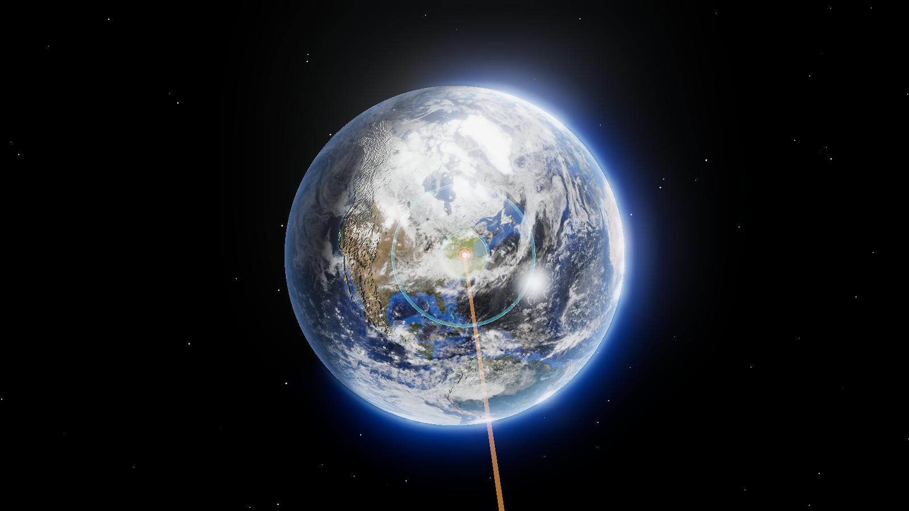
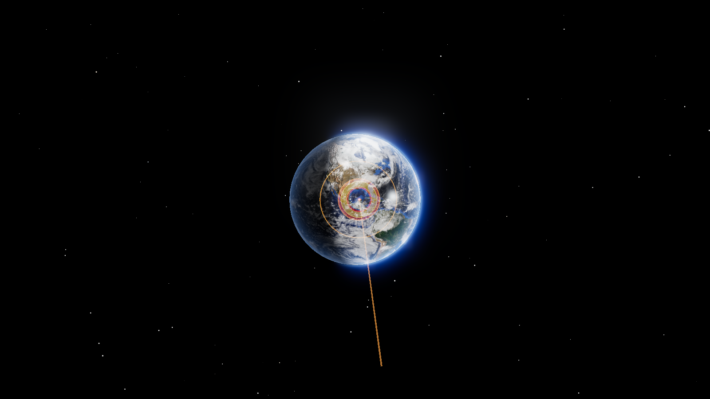

<div dir="rtl">

# الحارس المداري — محاكي ارتطام الكويكبات

*(للنسخة الإنجليزية: [README.md](README.md))*

محاكي تفاعلي ثلاثي الأبعاد لارتطام الأجرام القريبة من الأرض. تُدخِل كويكباً —
إمّا بخصائصه الفيزيائية أو بعناصره المدارية الحقيقية — فيقوم البرنامج بنشر مداره
عبر الزمن، ويقرّر ما إذا كانت الأرض ستأسره، ويحسب **أين** بالضبط سيسقط على
الكوكب الدوّار، ثم يحاكي ما سيفعله ذلك بالأرض وبالبشر الذين يعيشون هناك. تُعرض
النتيجة على كرة أرضية واقعية ثلاثية الأبعاد.

كل شيء يعمل محلياً. لا مفاتيح API، لا حسابات، ولا أي علاقة دفع مع أي خدمة.



*جرم صخري قطره ٩٠٠ متر يرتطم بالساحل الشرقي. الحلقات تمتد من الدمار الكامل
(٦٧ كم) إلى تحطّم النوافذ (٢١٦٤ كم)، وهي مرسومة كأشرطة كروية حقيقية على سطح
الكرة لا كصورة مسطّحة.*



*ارتطام تشيكشولوب بمعطياته التاريخية. النموذج يعطي فوهة نهائية قطرها ١٦٤ كم
مقابل ~١٨٠ كم المقاسة في الصخر.*

---

## ١. البنية العامة

يتكوّن المشروع من ثلاث طبقات، وكل طبقة منها **مُتحقَّق منها مقابل شيء حقيقي**:

| الطبقة | الملف | ماذا تفعل |
|---|---|---|
| الميكانيكا المدارية | `orbital.py` | نشر المدار، إيجاد الاقترابات، حلّ نقطة الارتطام |
| فيزياء الدخول والارتطام | `impact.py` | التفتّت في الغلاف الجوي، الفوهة، الانفجار، الحرارة، الزلزال، تسونامي |
| التعلّم الآلي | `dataset.py` + `train.py` + `predict.py` | نماذج بديلة سريعة تحاكي الفيزياء |

بالإضافة إلى:

- `geo.py` — قناع اليابسة/المحيط وقاعدة بيانات المدن لحساب السكان المعرّضين
- `main.py` — خدمة FastAPI التي تربط كل شيء وتقدّم الواجهة
- `frontend/` — الواجهة ثلاثية الأبعاد بلغة JavaScript و WebGL

---

## ٢. البيانات — من أين تأتي؟

كل المصادر **مجانية تماماً، بلا مفتاح ولا حساب ولا بطاقة دفع**. تُنزَّل مرة واحدة
عبر `fetch_data.py` ثم يعمل التطبيق دون إنترنت.

### أ. قاعدة بيانات الأجسام الصغيرة (JPL SBDB)

المصدر: `ssd-api.jpl.nasa.gov/sbdb_query.api`

هذه قاعدة بيانات مختبر الدفع النفاث التابع لناسا. نُنزِّل منها **٤٢٬١٨٢ جرماً
قريباً من الأرض** حقيقياً، ولكل جرم:

- `a` — نصف المحور الرئيسي (بالوحدة الفلكية، أي متوسط بُعد الأرض عن الشمس)
- `e` — الانحراف المداري (٠ = دائرة، قريب من ١ = قطع ناقص ممدود جداً)
- `i` — الميل المداري بالدرجات عن مستوى دوران الأرض
- `Ω` — خط طول العقدة الصاعدة
- `ω` — زاوية الحضيض
- `M` — الشذوذ الوسطي (أين يقع الجرم على مداره في لحظة مرجعية)
- `epoch` — اللحظة المرجعية بالتاريخ اليولياني
- `H` — القدر المطلق، ومنه يُستنتج القطر
- `moid` — أدنى مسافة بين المدارين (نستعملها للتحقّق من حساباتنا)

هذه الأرقام الستة الأولى تُسمّى **عناصر كِبلر**، وهي تصف المدار كاملاً.

### ب. قائمة سينتري (CNEOS Sentry)

المصدر: `ssd-api.jpl.nasa.gov/sentry.api`

نظام المراقبة الآلي في ناسا. يحتوي على **٢٬١٨٤ جرماً** لها احتمال ارتطام محسوب
غير معدوم، مع مقياس باليرمو ومقياس تورينو للخطورة. نستعملها كمرجع واقعي.

### ج. قاعدة مدن GeoNames

المصدر: `cities15000` — كل مدينة يزيد سكانها عن ١٥٬٠٠٠ نسمة.

**٣٤٬٠٩٦ مدينة** بإجمالي **٣٫٩٤ مليار نسمة**، مع الإحداثيات وعدد السكان. تُستعمل
لحساب كم إنساناً يقع داخل كل حلقة ضرر.

> ملاحظة مهمة: هذا يُحصي سكان المدن فقط، أي أن سكان الأرياف **غير محسوبين**،
> فالأرقام التي يعرضها التطبيق هي حدّ أدنى لا تقدير كامل.

### د. صور ناسا للأرض

- `Blue Marble` — خريطة الأرض نهاراً بدقة عالية
- `Earth at Night` — أضواء المدن ليلاً
- `Cloud Combined` — طبقة السحب
- خرائط الانعكاس والنتوءات من مستودع Three.js

### هـ. قناع اليابسة والمحيط

لا نُنزِّله؛ بل **نُشتقّه** من خريطة الانعكاس: في تلك الصورة المحيطات ساطعة
(لأنها تعكس الضوء) واليابسة سوداء تقريباً، فيكفي حدّ سطوع بسيط للفصل بينهما.
النتيجة شبكة منطقية بأبعاد ١٤٤٠×٧٢٠.

**التحقّق:** نسبة اليابسة الناتجة ٣٢٫٢٪ مقابل القيمة الحقيقية ٢٩٪ — قريبة جداً،
وهذا يؤكّد أن الطريقة سليمة.

---

## ٣. الميكانيكا المدارية — كيف نعرف أين سيمرّ الكويكب؟

### حلّ معادلة كِبلر

المدار الإهليلجي يوصف بمعادلة كِبلر:

```
M = E − e·sin(E)
```

حيث `M` معلوم و `E` (الشذوذ الإكسنتري) مجهول. لا يوجد حلّ جبري مباشر، فنستعمل
طريقة **نيوتن-رافسون** انطلاقاً من تخمين دانبي:

```
E₀ = M + 0.85·e·sign(sin M)
```

التخمين الساذج `E₀ = M` يفشل عند الانحرافات العالية، أما تخمين دانبي فيتقارب في
خطوات قليلة.

**التحقّق:** الخطأ المتبقي يبقى عند `4×10⁻¹⁶` حتى عند `e = 0.995`، أي عند حدود
دقّة الآلة نفسها.

### موقع الأرض

نستعمل عناصر **ستانديش التقريبية** لمدار الأرض، وهي دقيقة إلى حدود دقائق قوسية
للفترة ١٨٠٠–٢٠٥٠.

### إيجاد الاقترابات

1. مسح خشن: نحسب المسافة بين الكويكب والأرض كل يوم على مدى ٣٠ سنة
2. لكل حدّ أدنى محلّي، نُدقّق الموضع بطريقة **القطع الذهبي**

### قرار الارتطام — الأسر الجذبوي

هنا نقطة مهمة يخطئ فيها كثيرون: **الأرض لا تلتقط ما يمرّ داخل نصف قطرها فقط**.
جاذبيتها تسحب الأجسام نحوها، فتزداد مساحة مقطعها الفعّالة:

```
b_crit = R · √(1 + v_esc² / v_inf²)
```

أي أن الجسم **البطيء يُؤسَر من مسافة أبعد بكثير** من الجسم السريع. لهذا نستعمل
`b_crit` لا `R` في قرار الارتطام.

### أين يسقط بالضبط؟

عند الاقتراب، مسار الجسم حول الأرض يكون **قطعاً زائداً** (هذلولياً). نحلّه:

1. من اتجاه الاقتراب ومُعامل التصادم `b` نبني القطع الزائد
2. نجد الشذوذ الحقيقي حيث يساوي نصف القطر حدود الغلاف الجوي (١٠٠ كم)
3. ندوّر تلك النقطة عبر **ميل محور الأرض** ثم عبر **الزمن النجمي في غرينتش
   (GMST)** للحصول على خط العرض وخط الطول على الأرض الدوّارة

هذه الخطوة الأخيرة هي ما يجعل التطبيق يقول «سيسقط هنا» بدل «سيسقط في مكان ما».

### مسافة MOID

`MOID` هي **أدنى مسافة يمكن أن يقترب فيها المداران نفسيهما**، بغضّ النظر عن
توقيت وجود الجسمين. أهميتها أنها **شرط لازم**: لا يمكن لأي لقاء أن يكون أقرب من
MOID مهما كان التوقيت.

نحسبها بمسح مزدوج خشن ثم تدقيق بنافذة متقلّصة.

**التحقّق مقابل أرقام ناسا المنشورة (٣٠٠ جرم حقيقي):**

| المقياس | القيمة |
|---|---|
| الوسيط المطلق للخطأ | ٠٫٠٠٠١٣٨ وحدة فلكية |
| المئين ٩٠ | ٠٫٠٠٠٦٧٤ وحدة فلكية |
| فايثون (Phaethon) | ٠٫٠١٨٧٠ مقابل ٠٫٠١٨٧٠ عند ناسا |
| إيروس (Eros) | ٠٫١٤٨٦٤ مقابل ٠٫١٤٩٠٠ عند ناسا |

---

## ٤. فيزياء الدخول والارتطام

### المرحلة الأولى: الدخول في الغلاف الجوي

معظم البرامج تستعمل صيغاً مغلقة تقريبية. نحن نستعمل **تكاملاً عددياً مباشراً**
لنموذج «الفطيرة» (Hills & Goda 1993؛ Chyba et al. 1993).

الفكرة: الجسم يدخل الغلاف الجوي، فيزداد ضغط الاصطدام الهوائي. حين يتجاوز هذا
الضغط **مقاومة المادة**، يتفتّت الجسم. الشظايا تتباعد جانبياً فتزداد المساحة
المعرّضة، فيزداد التباطؤ، وهكذا في حلقة متسارعة تنتهي بانفجار جوي.

المعادلات التي نُكامِلها:

```
مقاومة المادة:   Y = 10^(2.107 + 0.0624·√ρ)
التباطؤ:         dv/dz = C_d·ρ_air·A·v² / (2·m·sin θ) − g/v
التباعد الجانبي: du/dt = C_d·ρ_air·v² / (ρ_i·L)
                 dL/dt = u
```

**هنا وقع خطأ مهم أثناء البناء وتمّ إصلاحه:** في البداية جعلتُ سحابة الشظايا
تتباعد فوراً بسرعتها النهائية. لكن الصحيح فيزيائياً أن التباعد **يتسارع من
السكون** تحت تأثير تدرّج الضغط. تصحيح ذلك غيّر النتائج جذرياً:

| | قبل التصحيح | بعد التصحيح | المرصود فعلياً |
|---|---|---|---|
| ارتفاع انفجار تونغوسكا | ٢٢٫٧ كم | ١٢٫٧ كم | ~٨ كم |
| فوهة باريندجر | لا فوهة إطلاقاً | ١٢٣٤ م | ١٢٠٠ م |

التكامل **مُتَّجَه (vectorised)**، أي أنه يعالج مئات الآلاف من الأجسام دفعة
واحدة — وهذا ما يجعل توليد بيانات التدريب ممكناً في ثوانٍ.

### المرحلة الثانية: آثار الارتطام

نتّبع مرجع **Collins, Melosh & Marcus (2005)**، وهو الأساس العلمي المُحكَّم
لبرنامج «Earth Impact Effects Program» التابع لناسا وإمبريال كوليدج.

**الفوهة** (قياس مجموعة باي):

```
D_tc = 1.161 · (ρ_i/ρ_t)^⅓ · L^0.78 · v^0.44 · g^−0.22 · (sin θ)^⅓
```

ثم تُحوَّل الفوهة الانتقالية إلى نهائية: بسيطة إن قلّ قطرها عن ٣٫٢ كم، ومعقّدة
(بقمة مركزية وحلقات) إن زاد.

**القدر الزلزالي:** `M = 0.67·log₁₀(E) − 5.87`

**الإشعاع الحراري:** التعرّض `Φ = η·E / (2πr²)` مع عتبات للحروق من الدرجات
الأولى والثانية والثالثة واشتعال الملابس والأشجار — مع **قصّ عند الأفق**، لأن
كرة النار تختفي خلف انحناء الأرض بعد مسافة معيّنة.

**موجة الضغط:** `p(R) = p_x·r_x/(4R) · (1 + 3·(r_x/R)^1.3)`

**التسونامي:** يُحسب من التجويف المحفور في **الماء** لا في القاع.

### تصحيح مهم آخر: الارتطام في المحيط

في البداية كنت أستعمل **كثافة الماء** كهدف في حساب الفوهة. هذا خطأ: الفوهة تُحفر
في **قاع البحر الصخري** لا في عمود الماء. بعد التصحيح:

- الجسم الصغير: يُمتصّ في الماء، **لا فوهة**، لكنه يولّد تسونامي
- الجسم الكبير (أعمق من عمود الماء ~٣٧٠٠ م): يحفر فوهة في القاع الصخري

### المعايرة مقابل أحداث حقيقية

**هذا أهم جدول في المشروع كلّه** — لا يوجد أي ضبط خاص بكل حدث، نفس المعادلات
للجميع:

| الحدث | الكمية | النموذج | المرصود |
|---|---|---|---|
| تشيليابينسك ٢٠١٣ | الطاقة | ٠٫٥٢ ميغاطن | ~٠٫٥ ميغاطن |
| تشيليابينسك ٢٠١٣ | ارتفاع الانفجار | ٣٤٫٤ كم | ٢٩٫٧ كم |
| تونغوسكا ١٩٠٨ | الطاقة | ١٠٫٨ ميغاطن | ١٠–١٥ ميغاطن |
| تونغوسكا ١٩٠٨ | ارتفاع الانفجار | ١٢٫٧ كم | ~٨ كم |
| **فوهة باريندجر** | **القطر النهائي** | **١٢٣٤ م** | **١٢٠٠ م** |
| تشيكشولوب | القطر النهائي | ١٦٤ كم | ~١٨٠ كم |

هذا **ستّة أسس عشرية** من فرق الطاقة، والنموذج يصمد عبرها كلها.

---

## ٥. التعلّم الآلي — وهذا لبّ المشروع

### النموذج الأول: مُصنِّف الارتطام

**المدخلات:** عناصر كِبلر الستة، بالإضافة إلى خصائص مشتقّة:
- الحضيض `q` والأوج `Q` والبعد عن ١ وحدة فلكية
- **مُعامل تيسيران** بالنسبة للأرض
- جيب وجيب تمام الزوايا (لأن الزوايا دورية)
- **مسافة MOID** ← وهذه هي المفتاح

**المخرَج:** احتمال أن يصطدم هذا المدار بالأرض خلال ٣٠ سنة.

**التسميات:** تأتي من نشر المدار فعلياً واختبار الأسر الجذبوي — أي أن الفيزياء
هي المعلّم.

#### لماذا هذه المهمة ذات معنى أصلاً؟

قد يسأل أحدهم: «إن كنت تستطيع حساب الجواب بالفيزياء، فلماذا تدرّب نموذجاً؟»

الجواب دقيق ومهم: حدّ الفصل بين «يرتطم» و«لا يرتطم» في فضاء العناصر المدارية
**رفيع جداً وفوضوي** — تغيير بمقدار متر واحد في الثانية يزيح موقع اللقاء آلاف
الكيلومترات. لا يستطيع أي نموذج حفظ هذا الحدّ.

وهنا تكمن الفائدة: بما أنه لا يستطيع الحفظ، فإن **الاحتمال الذي يُخرجه يتقارب مع
نسبة المدارات المجاورة التي ترتطم فعلاً** — وهذه بالضبط هي احتمالية الارتطام تحت
عدم اليقين الرصدي. أي أن النموذج يتعلّم شيئاً ذا معنى فيزيائي، لا مجرد حفظ.

#### مشكلة ندرة الأمثلة الموجبة

بالعيّنة العشوائية الساذجة، نسبة المدارات المرتطمة **واحد في عشرة ملايين**. لا
يمكن تدريب أي شيء على ذلك.

الحلّ: **مزيج من مصدرين**:

1. **مدارات حقيقية** من فهرس ناسا مع ضوضاء مضافة
2. **مدارات مبنيّة عكسياً**: نختار لحظة لقاء، نضع الجسم قرب الأرض بسرعة نسبية
   معقولة، ثم **نعكس متجه الحالة إلى عناصر مدارية**. كل مدار يُنتَج بهذه الطريقة
   يمرّ قرب الأرض بالضرورة.

النتيجة: نسبة الأمثلة الموجبة ترتفع إلى **~٩٪**، وهو قابل للتدريب.

#### النتيجة الحاسمة: أثر إضافة MOID

في البداية دربتُ النموذج **بدون** MOID، وكانت النتيجة ضعيفة. إضافة MOID كخاصية
غيّرت كل شيء — **على نفس البيانات تماماً**، لم يتغيّر إلا مجموعة الخصائص:

| المقياس | بدون MOID | مع MOID |
|---|---|---|
| ROC-AUC | ٠٫٦٩١ | **٠٫٩٢٥** |
| PR-AUC | ٠٫١٦١ | **٠٫٤٤٣** |
| R² لمسافة الاقتراب | ٠٫٣٧١ | **٠٫٨٣٣** |

هذا هو **هندسة الخصائص** في أنقى صورها: معرفة الفيزياء أهم من زيادة البيانات أو
تعقيد النموذج.

### النموذج الثاني: نماذج آثار الارتطام

**المدخلات:** القطر، الكثافة، السرعة، زاوية الدخول، كثافة الهدف.

**المخرجات:** ثمانية مقادير — الطاقة، ارتفاع الانفجار، قطر الفوهة، ثلاثة أنصاف
أقطار للانفجار، نصف قطر الحروق، القدر الزلزالي.

#### مشكلة الأهداف المنقطعة — وإصلاحها

هنا اكتُشفت مشكلة حقيقية عند فحص النتائج: **خطأ ١١٢٪ في قطر الفوهة، و١٠٠٪ في
ارتفاع الانفجار**.

السبب منطقي تماماً: **الجسم الذي ينفجر في الجو لا يترك فوهة**، والجسم الذي يصل
الأرض **ليس له ارتفاع انفجار**. حين نُدرّب النموذج على كل العيّنات، نُجبره على
عبور هاوية بين قيم حقيقية وقيمة نائبة (سنتينل)، فيفسد على الجانبين معاً.

**الإصلاح:** كل هدف من هذين يُدرَّب **فقط حيث يكون معرَّفاً**:
- ارتفاع الانفجار ← على عيّنات الانفجار الجوي فقط
- قطر الفوهة ← على عيّنات الارتطام السطحي فقط

ثم عند الاستدلال، **يقرّر مُصنِّف الانفجار الجوي** أي النموذجين يُقرأ.

النتيجة بعد الإصلاح: أخطاء تراوحت بين **٠٫٠٪ و٩٫٤٪** بدل ١١٢٪.

### الصدق المنهجي: عرض النموذج مقابل الفيزياء

التطبيق **يعرض الاثنين جنباً إلى جنب مع نسبة الخطأ** في كل مرة. هذا اختيار
مقصود: دقّة النموذج تبقى **مرئية** بدل أن تكون مجرد ادّعاء في ملف README.

### مونت كارلو: الاحتمال الصادق

المُصنِّف يعطي **درجة خطورة** سريعة للفرز. أما الاحتمال الحقيقي لمدار بعينه
فيُحسب بمحاكاة مونت كارلو: نولّد سحابة من آلاف «النسخ» ضمن هوامش الخطأ الرصدي،
وننشرها كلها، ونعدّ كم منها ارتطم. ثم نعطي فترة ثقة **ويلسون** ٩٥٪.

#### تحسين خوارزمي مهم

في البداية كانت المحاكاة تمسح ١٠٬٩٥٧ يوماً لكل نسخة — وكانت تستغرق ~٤٥ ثانية،
وهو ما جعل الواجهة تبدو معلّقة.

الملاحظة الفيزيائية: اضطرابات النسخ صغيرة جداً (~١٠⁻⁵)، فلا يمكنها أن تزيح موعد
اللقاء أكثر من يوم أو يومين. إذن يكفي البحث **حول لحظات اللقاء المعروفة للمدار
الاسمي** بدل مسح الثلاثين سنة كاملة لكل نسخة.

النتيجة: **من ٤٥ ثانية إلى ٤–٩ ثوانٍ**، مع **نفس الجواب بالضبط** (وسيط المسافة
٠٫٢٦٢٧٠ وحدة فلكية في الحالتين) — أي أن التسريع لم يكلّف أي دقّة.

### لماذا أشجار التدرّج المعزّزة ولماذا لا شبكات عصبية؟

- لا تحتاج إلى معايرة أو تطبيع للخصائص
- تتعامل مع الانقطاعات والقيم النائبة بطبيعتها
- تتدرّب على معالج حاسوب محمول في دقائق لا ساعات
- البيانات جدولية بأبعاد صغيرة — وهو المجال الذي تتفوّق فيه الأشجار على الشبكات

---

## ٦. الواجهة ثلاثية الأبعاد

### الكرة الأرضية

أربع طبقات مرسومة من الداخل إلى الخارج:

1. **السطح** — مُظلِّل GLSL مخصّص يحسب إضاءته بنفسه ليضبط **خط الفجر
   (terminator)** بدقّة: أضواء المدن تظهر تماماً حيث تغيب الشمس، وانعكاس الشمس
   على المحيط يبقى حتى حافّة النهار، مع تدفئة الضوء عند الشفق كما تفعل الشمس
   المنخفضة فعلاً
2. **السحب** — قشرة مستقلة تدور بمعدّلها الخاص وتُلقي ظلاً على السطح
3. **الضباب الداخلي** — توهّج رقيق ملتصق بالحافّة
4. **الهالة الخارجية** — التوهّج الأزرق الذي يُرى من المدار، مع **تشتّت أمامي**
   (يشتدّ حين ننظر عبر الغلاف الجوي باتجاه الشمس)

### حلقات الضرر

تُرسم كأشرطة كروية حقيقية على سطح الكرة (لا صور مسطّحة)، تتفتّح بالتتابع بعد
وميض الارتطام، ثم تنبض بهدوء.

### الوضعان

- **وضع الأرض** — الارتطام نفسه
- **وضع المدار** — مركزية الشمس، يُظهر مدار الكويكب مقابل مدار الأرض

### دعم اللغة العربية

- ترجمة كاملة للواجهة عبر `i18n.js`
- تخطيط **من اليمين إلى اليسار** كامل مع تبديل مواضع اللوحات
- **إلغاء التباعد بين الحروف** في العربية — لأن الحروف العربية متّصلة والتباعد
  يكسر الاتصال بينها
- **عزل الأرقام** باتجاه من اليسار إلى اليمين داخل النص العربي

---

## ٧. حدود المشروع — ما لا يفعله

الصدق العلمي يقتضي ذكر ما لا يستطيعه:

1. **نشر ثنائي الجسم فقط.** لا اضطرابات كوكبية، لا تأثير يارکوفسكي، لا تصحيحات
   نسبية. أنظمة المراقبة الحقيقية (Sentry) تستعمل تكاملاً كامل الأجسام. لذلك
   مسافات الاقتراب المتوقّعة هنا تنحرف عن الواقع عبر العقود. أما MOID فتبقى
   دقيقة لأنها مستقلّة عن التوقيت.
2. **ضغط الانفجار الجوي** يُحسب عند المسافة المائلة، فيُقلّل من تعزيز «ساق ماخ»
   في المدى المتوسط بعامل يصل إلى ٢.
3. **السكان** تُحصى من المدن فقط، فسكان الأرياف غير محسوبين.
4. **التسونامي** تقدير بمرتبة المقدار فقط.

---

## ٨. كيف تشغّله

</div>

```bash
cd asteroid-impact-simulator && ./run.sh --setup
```

<div dir="rtl">

على ويندوز:

</div>

```powershell
cd asteroid-impact-simulator; .\run.ps1 -Setup
```

<div dir="rtl">

ثم افتح `http://127.0.0.1:8712`. ولتدريب النماذج بنفسك:

</div>

```bash
./run.sh --train
```

<div dir="rtl">

التدريب يستغرق دقائق على معالج حاسوب محمول. الفيزياء التحليلية تعمل بدون
النماذج؛ تختفي فقط أعمدة النموذج البديل.

---

## ٩. المراجع العلمية

- **Collins, G.S., Melosh, H.J., Marcus, R.A. (2005).** *Earth Impact Effects
  Program.* Meteoritics & Planetary Science 40, 817–840.
- **Hills, J.G., Goda, M.P. (1993).** *The fragmentation of small asteroids in
  the atmosphere.* Astronomical Journal 105, 1114.
- **Chyba, C.F., Thomas, P.J., Zahnle, K.J. (1993).** *The 1908 Tunguska
  explosion.* Nature 361, 40–44.
- **Standish, E.M. (1992).** *Keplerian Elements for Approximate Positions of
  the Major Planets.* JPL Solar System Dynamics.

</div>
