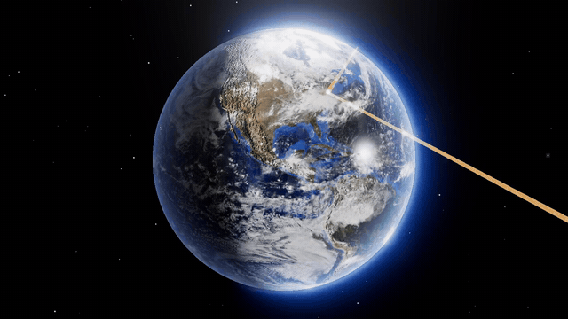

# Orbital Sentinel

*[النسخة العربية](README.ar.md)*

An interactive near-Earth-object impact simulator. Enter an asteroid — either as
physical properties or as real Keplerian orbital elements — and the app
propagates its orbit, decides whether it strikes Earth, works out *where* on the
rotating planet it lands, and models what that does to the ground and the people
on it. The result is drawn on a photoreal 3D globe.

Everything runs locally. No API keys, no accounts, no billing relationship with
any service.



*Real footage of the running app — the approach, the detonation flash, and the
damage rings blooming outward. Rendered frame by frame from the WebGL canvas
([full-quality MP4](docs/video/impact.mp4)).*


*A 900 m stony impactor on the US east coast. Rings run from total destruction
(67 km) out to window breakage (2,164 km), drawn as real spherical bands on the
globe rather than a flat decal.*


*The Chicxulub impactor at its historical parameters. The model puts the final
crater at 164 km against the ~180 km measured in the rock.*

---

## What it actually computes

The app is three layers, and each one is checked against something real.

### 1. Orbital mechanics

Heliocentric Keplerian propagation in the J2000 ecliptic frame.

* Kepler's equation solved by Newton–Raphson from a Danby starting guess —
  residuals stay at `4e-16` even at `e = 0.995`, where the naive guess stalls.
* Earth's position from Standish's approximate elements.
* Close approaches found by a coarse sweep, then golden-section refinement.
* Impact decided by **gravitational focusing**, not by geometric radius:
  `b_crit = R·√(1 + v_esc²/v_inf²)`. A slow body is captured from much further
  out than a fast one.
* The landing site comes from solving the **hyperbolic encounter** about Earth:
  the incoming asymptote and impact parameter give a hyperbola, we find the true
  anomaly where its radius equals the atmospheric interface, then rotate that
  point through the obliquity and GMST into Earth-fixed coordinates.

**MOID** — the closest the two orbit *ellipses* ever come, regardless of timing —
is computed by a coarse double sweep plus shrinking-window refinement.

| MOID check vs JPL's published values (300 real NEOs) | |
|---|---|
| Median absolute error | 0.000138 AU |
| 90th percentile | 0.000674 AU |
| Phaethon | 0.01870 vs JPL 0.01870 |
| Eros | 0.14864 vs JPL 0.14900 |

### 2. Entry and impact physics

Atmospheric entry is a **numerical integration of the pancake fragmentation
model** (Hills & Goda 1993; Chyba et al. 1993) down an exponential atmosphere,
rather than the closed-form approximations usually used. The fragment cloud
accelerates apart from rest under the ram-pressure gradient — getting this right
is what moved Tunguska's burst altitude from 22.7 km to 12.7 km and made
Barringer produce a crater at all.

Downstream effects follow Collins, Melosh & Marcus (2005) — crater π-group
scaling, seismic magnitude, thermal exposure with horizon clipping, air-blast
overpressure, ejecta, and tsunami.

**Calibration against real events:**

| Event | Quantity | Model | Observed |
|---|---|---|---|
| Chelyabinsk 2013 | energy | 0.52 Mt | ~0.5 Mt |
| Chelyabinsk 2013 | burst altitude | 34.4 km | 29.7 km |
| Tunguska 1908 | energy | 10.8 Mt | 10–15 Mt |
| Tunguska 1908 | burst altitude | 12.7 km | ~8 km |
| **Barringer Crater** | **final diameter** | **1234 m** | **1200 m** |
| Chicxulub | final diameter | 158 km | ~180 km |

That is six orders of magnitude in energy with no per-event tuning.

### 3. Machine learning

Two model families, both gradient-boosted histogram trees.

**Impact classifier.** Features are the six orbital elements plus derived
geometry — Tisserand parameter, perihelion/aphelion distance from 1 AU, and
crucially the MOID. Labels come from actually propagating each orbit and testing
capture.

The interesting property: the impact boundary in element space is razor-thin and
chaotic — a metre per second changes the encounter by thousands of kilometres.
The classifier cannot memorise it, so its output probability converges on *the
fraction of nearby orbits that strike*, which is exactly the Monte-Carlo impact
probability under observational uncertainty.

Adding MOID was decisive:

| | without MOID | with MOID |
|---|---|---|
| ROC-AUC | 0.691 | **0.925** |
| PR-AUC | 0.161 | **0.443** |
| Distance R² | 0.371 | **0.833** |

Trained at full size (110,873 orbits, 8.2% positive) it reaches **ROC-AUC
0.944**, **PR-AUC 0.542**, distance **R² 0.858** — and it is well calibrated,
which is the claim that matters:

| predicted | observed | n |
|---|---|---|
| 0.002 | 0.001 | 15,449 |
| 0.167 | 0.173 | 1,754 |
| 0.373 | 0.362 | 1,537 |
| 0.589 | 0.582 | 1,271 |

A predicted 37% really does strike 36% of the time, so the classifier's output
can be read as an impact probability rather than just a ranking score.

Positive examples are ~1-in-10-million under naive sampling, so orbits are drawn
from a mixture: most bootstrapped from the real JPL catalogue with noise, the
rest **constructed backwards** from a chosen encounter geometry — pick an epoch,
place the body near Earth with a plausible relative velocity, invert the state
vector to elements. That lifts the positive class to ~9%.

**Effects regressors.** Impactor properties to the full damage profile. Two
targets are *conditional* — a body that bursts in the air leaves no crater, one
that reaches the ground has no burst altitude — so each is fitted only where it
is defined and gated at inference by the airburst classifier.

Trained on 120,000 impactors, every target lands at **R² 0.979–0.9999**. The UI
shows the surrogate and the analytic physics **side by side with the error
percentage**, so the model's accuracy is visible rather than asserted — including
the cases where it is poor, such as small iron bodies near the airburst
threshold, where the surrogate can be tens of percent out on crater size.

### Honest limitations

* Two-body Keplerian propagation. No planetary perturbations, no Yarkovsky, no
  relativistic terms. Real impact monitoring (JPL Sentry) uses full n-body
  integration; predicted encounter distances here drift from reality over
  decades. MOID, which is phase-independent, stays accurate.
* Airburst overpressure is evaluated at slant range, which under-predicts
  mid-field Mach-stem enhancement by up to ~2×.
* Population exposure counts cities over 15,000 people, so rural population is
  undercounted.
* Tsunami modelling is order-of-magnitude only.

---

## Running it

```bash
cd orbital-sentinel && ./run.sh --setup
```

On Windows:

```powershell
cd orbital-sentinel; .\run.ps1 -Setup
```

Then open <http://127.0.0.1:8712>. To train the models yourself:

```bash
./run.sh --train
```

Training takes a few minutes on a laptop CPU. The analytic physics works without
the models; only the surrogate columns go blank.

---

## Data sources

All free, no key, no account.

| Source | Used for |
|---|---|
| JPL Small-Body Database Query API | 42,182 real NEO orbits |
| NASA CNEOS Sentry | 2,184 objects with non-zero computed impact risk |
| GeoNames `cities15000` | 34,096 cities for population exposure |
| NASA Blue Marble / Earth at Night | globe textures |

Assets are downloaded once and cached, so the app runs fully offline afterwards.

---

## Layout

```
backend/
  app/
    constants.py     physical constants
    orbital.py       Kepler solvers, ephemeris, encounters, MOID, batch propagation
    impact.py        pancake entry ODE + Collins-Melosh-Marcus effects
    geo.py           land mask, city database, population exposure
    dataset.py       training-set generation
    train.py         model fitting and evaluation
    predict.py       inference, Monte Carlo, surrogate-vs-physics comparison
    main.py          FastAPI service
    build_assets.py  one-off asset preparation
  data/              catalogues and caches
  models/            trained artefacts + training report
frontend/
  index.html
  css/style.css
  js/
    scene.js         renderer, cameras, starfield, bloom
    earth.js         globe shaders: terminator, city lights, clouds, atmosphere
    overlay.js       impact marker, damage rings, trajectory, detonation
    system.js        heliocentric orbit view
    ui.js            results rendering
    main.js          orchestration
```

---

## API

| Endpoint | Purpose |
|---|---|
| `GET /api/health` | status, material presets, uncertainty presets |
| `GET /api/neos?search=&limit=` | real NEOs from the JPL catalogue |
| `GET /api/sentry` | CNEOS Sentry risk list |
| `GET /api/geo/terrain?lat=&lon=` | land/ocean and nearest cities |
| `POST /api/effects` | damage profile only — the slider fast path |
| `POST /api/simulate/simple` | impactor and impact point stated directly |
| `POST /api/simulate/elements` | propagate an orbit, resolve any encounter |
| `GET /api/models` | training report with all metrics |

---

## References

Collins, G.S., Melosh, H.J., Marcus, R.A. (2005). *Earth Impact Effects Program.*
Meteoritics & Planetary Science 40, 817–840.

Hills, J.G., Goda, M.P. (1993). *The fragmentation of small asteroids in the
atmosphere.* Astronomical Journal 105, 1114.

Chyba, C.F., Thomas, P.J., Zahnle, K.J. (1993). *The 1908 Tunguska explosion.*
Nature 361, 40–44.

Standish, E.M. (1992). *Keplerian Elements for Approximate Positions of the Major
Planets.* JPL Solar System Dynamics.
